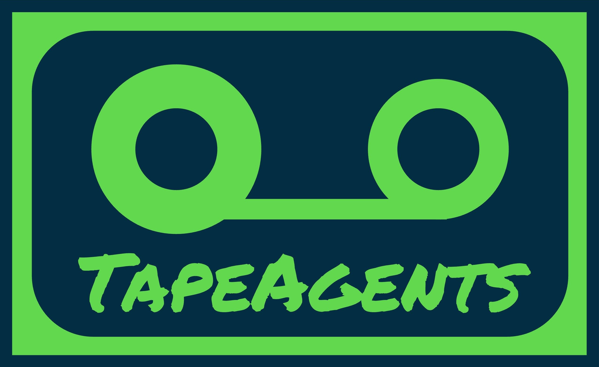
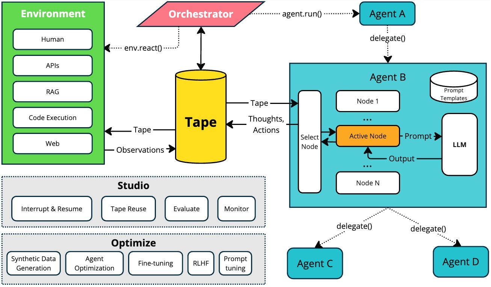

# TapeAgents

[](https://pypi.org/project/TapeAgents/)
[](https://github.com/ServiceNow/TapeAgents/releases)
[](https://servicenow.github.io/TapeAgents/)
[](https://arxiv.org/abs/2412.08445)


---



**TapeAgents** is a framework that leverages a structured, replayable log (**Tape**) of the agent session to facilitate all stages of the LLM Agent development lifecycle. In TapeAgents, the agent reasons by processing the tape and the LLM output to produce new thoughts, actions, control flow steps and append them to the tape. The environment then reacts to the agent’s actions by likewise appending observation steps to the tape.

## Why TapeAgents

Key features:

- Build your agent as a low-level state machine, as a high-level multi-agent team configuration, or as a mono-agent guided by multiple prompts
- Debug your agent with TapeAgent studio or TapeBrowser apps
- Serve your agent with response streaming
- Optimize your agent's configuration using successful tapes; finetune the LLM using revised tapes.

The Tape-centric design of TapeAgents will help you at all stages of your project:

- Build with ultimate flexibility of having access to tape for making prompts and generating next steps
- Change your prompts or team structure and resume  the debug session as long as the new agent can continue from the older tape
- Fully control the Agent's tape and the Agent's acting when you use a TapeAgent in an app
- Optimize tapes and agents using the carefully crafted metadata structure that links together tapes, steps, llm calls and agent configurations

## TapeAgents at a glance



## Getting Started

### Tutorial

Start with the [introductory Jupyter notebook](https://github.com/ServiceNow/TapeAgents/blob/main/intro.ipynb) to quickly learn the core concepts of the framework.

### Hello TapeAgents

The simplest agent just to show the basic structure of the agent:

```python
from tapeagents.agent import Agent, Node
from tapeagents.core import Prompt
from tapeagents.dialog_tape import AssistantStep, UserStep, DialogTape
from tapeagents.llms import LLMStream, LiteLLM
from tapeagents.prompting import tape_to_messages

llm = LiteLLM(model_name="gpt-4o-mini")


class MainNode(Node):
    def make_prompt(self, agent: Agent, tape: DialogTape) -> Prompt:
        # Render the whole tape into the prompt, each step is converted to message
        return Prompt(messages=tape_to_messages(tape))

    def generate_steps(self, agent: Agent, tape: DialogTape, llm_stream: LLMStream):
        # Generate single tape step from the LLM output messages stream.
        yield AssistantStep(content=llm_stream.get_text())


agent = Agent[DialogTape].create(llm, nodes=[MainNode()])
start_tape = DialogTape(steps=[UserStep(content="Tell me about Montreal in 3 sentences")])
final_tape = agent.run(start_tape).get_final_tape()  # agent will start executing the first node
print(f"Final tape: {final_tape.model_dump_json(indent=2)}")
```

### TapeAgents Examples

The [examples/](https://github.com/ServiceNow/TapeAgents/tree/main/examples) directory contains examples of how to use the TapeAgents framework for building, debugging, serving and improving agents. Each example is a self-contained Python script (or module) that demonstrates how to use the framework to build an agent for a specific task:

- How to build a single agent that [does planning, searches the web and uses code interpreter](https://github.com/ServiceNow/TapeAgents/tree/main/examples/gaia_agent) to answer knowledge-grounded questions, solving the tasks from the [GAIA benchmark](https://huggingface.co/spaces/gaia-benchmark/leaderboard).
- How to build [a team of TapeAgents](https://github.com/ServiceNow/TapeAgents/tree/main/examples/data_science) with [AutoGen](https://github.com/microsoft/autogen)-style low-code programming paradigm
- How to [finetune a TapeAgent](https://github.com/ServiceNow/TapeAgents/tree/main/examples/gsm8k_tuning) with a small LLM to be better at math problem solving on GSM-8k dataset.

Other notable examples that demonstrate the main aspects of the framework:

- [workarena](https://github.com/ServiceNow/TapeAgents/tree/main/examples/workarena) - custom agent that solves [WorkArena](https://github.com/ServiceNow/WorkArena) benchmark using [BrowserGym](https://github.com/ServiceNow/BrowserGym) environment.
- [tape_improver.py](https://github.com/ServiceNow/TapeAgents/tree/main/examples/tape_improver) - the agent that revisit and improves the tapes produced by another agent.

To run these examples, simply use:

```zsh
uv run -m examples.<MODULE> <ARGS>
```

## Installation

Install the latest release with its minimal dependencies:

```zsh
pip install tapeagents
```

You can also install converters and finetune optional dependencies

```zsh
pip install 'tapeagents[converters,finetune]'
```

## Building from source

0. Install uv to manage package:

Official documentation [here](https://docs.astral.sh/uv/getting-started/installation/)

1. Clone the repository:

```zsh
git clone https://github.com/ServiceNow/TapeAgents.git
cd TapeAgents
```

2. Create `venv` environment and install dependencies:

```zsh
make setup
# equivalent to `uv sync --all-extras`
```

## Learn more

See our full TapeAgents [documentation](https://servicenow.github.io/TapeAgents/).

For an in-depth understanding of the design principles, architecture, and research behind TapeAgents, see our [technical report](https://arxiv.org/abs/2412.08445).

## Contacts

Feel free to reach out to the team:

- Dzmitry Bahdanau, <dzmitry.bahdanau@servicenow.com>
- Oleh Shliazhko, <oleh.shliazhko@servicenow.com>
- Jordan Prince Tremblay, <jordanprince.t@servicenow.com>
- Alexandre Piché, <alexandre.piche@servicenow.com>

## Acknowledgements

We acknowledge the inspiration we took from prior frameworks, in particular [LangGraph](https://github.com/langchain-ai/langgraph), [AutoGen](https://github.com/microsoft/autogen), [AIWaves Agents](https://github.com/aiwaves-cn/agents) and [DSPy](https://github.com/stanfordnlp/dspy).
