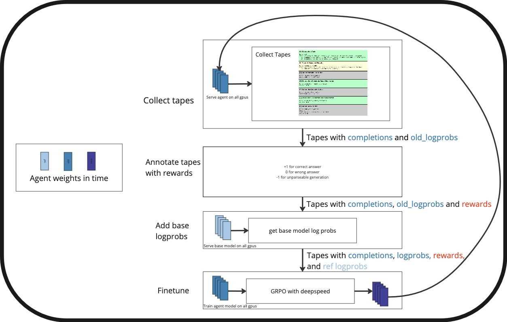

# Training Llama 3.2 1b with GRPO on GSM8k


This example demonstrates how to train [Llama 3.2 1B Instruct](https://huggingface.co/meta-llama/Llama-3.2-1B-Instruct) using [GRPO](https://arxiv.org/abs/2402.03300) to solve math problems from the [GSM8k](https://huggingface.co/datasets/openai/gsm8k) dataset.

Meta reports that the model obtains [44.4 on the GSM8k dataset (8 shot, CoT)](https://ai.meta.com/blog/llama-3-2-connect-2024-vision-edge-mobile-devices/). In this example, we will be strict and instruct the model to output its answer within `\boxed{}` which it initially fails to do. At the end of training the model respects the format and obtains a score of ~53 on the test set. 

## Quickstart

#### Prerequisities

We use vLLM for inference in our training pipeline. Install it as follows:

```bash
pip install 'tapeagents[finetune]'
```

Make sure you have a Huggingface account with access to <https://huggingface.co/meta-llama/Llama-3.2-1B-Instruct> and use `huggingface-cli` to login to the Hugging Face Hub. You may also want to test your vllm installation and downloading the model's weights by running the following command:

```bash
python -m vllm.entrypoints.openai.api_server --model meta-llama/Llama-3.2-1B-Instruct --dtype bfloat16
```

#### Run training loop

The example can be run in 2 hours on a H100 (should also run on a A100):

```bash
python -m examples.rl_gsm8k.orchestrate_rl
```

By default, the script uses `conf/rl_gsm8k.yaml` as the configuration file. 


## Overview of examples.rl_gsm8k.orchestrate_rl



### Collect online RL training data

#### Collect tapes

* The current model is served on the gpus using vllm.
* A subset of `cfg.max_agent_forks/cfg.attempts` tasks from the train set of gsm8k is sampled and replicated `cfg.attempts` times each for a total of `cfg.max_agent_forks` tasks.
* the agent produce complete tapes for each of these tasks using temperature `cfg.llm.parameters.temperature`.
* Traces are created from these new tapes.
* The log prob of the traces under the current model are collected during inference.

#### Annotate tapes with rewards

* For each trace, the reward is computed as follows:
  * +1 for correct answer.
  * 0 for incorrect answer.
  * -1 for answer that cannot be parsed or overflow.

#### Annotate tapes with ref log probs

* The current model is taken down and the reference model is now served on all gpus using vllm.
* The log prob from the reference model (llama 3.2 1b instruct) are computed for the most recent traces.

### Evaluation (Not shown in the figure)

* Every `cfg.test_every_n_iterations` iterations, the agent is evaluated with temperature 0 on the complete test set of gsm8k. No traces are produced on the test set.

### Finetune

* GRPO training is performed on the latest batch of data using a separate process. This makes it easier to manage GPU memory with the main process. Otherwise there are sometimes issues with the GPUs not being completely empty after fine tuning.
* The finetuning length between each sampling iteration can be controlled via `cfg.finetune.save_checkpoint_steps` and the batch size can be controlled using `cfg.finetune.train_batch_size` and `cfg.finetune.gradient_accumulation_passes`.
